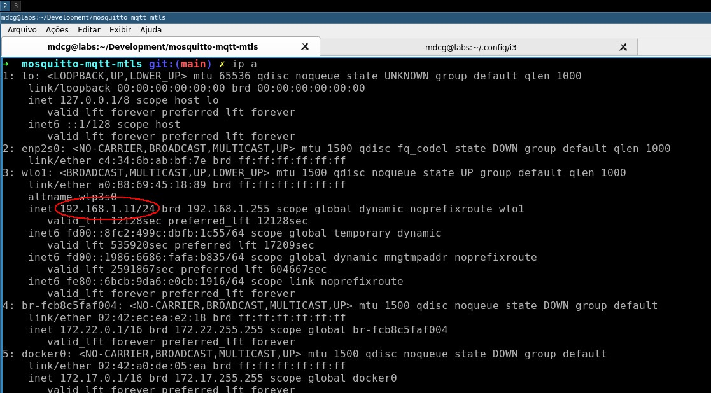

# mosquitto-mqtt-mtls

## Introdução

Este projeto tem como objetivo testar a autenticação mTLS para comunicação de sistemas MQTT. 

O mTLS, ou Transport Layer Security com mútua autenticação (mutual TLS), é uma extensão do protocolo TLS (Transport Layer Security), que é utilizado para garantir a segurança nas comunicações pela internet. O mTLS estabelece uma camada de segurança na comunicação entre dois sistemas, permitindo a autenticação mútua entre o cliente e o servidor.

Enquanto o TLS tradicional autentica apenas o servidor para o cliente, o mTLS exige que ambos, cliente e servidor, se autentiquem, fornecendo certificados digitais. Isso cria uma troca bidirecional de certificados, garantindo que ambas as partes possam validar a identidade uma da outra.

O uso do mTLS é especialmente interessante em ambientes onde a segurança é crucial, como transações financeiras, sistemas de saúde e em qualquer situação em que a autenticação recíproca seja necessária para garantir a integridade e a confidencialidade das comunicações

Para simplificar o processo de geração de chaves, certificados e assinaturas necessárias, este repositório disponibiliza uma variedade de scripts específicos para essa finalidade. As próximas seções apresentarão instruções detalhadas sobre como empregar esses scripts de maneira eficaz. Além disso, oferece-se a conveniência de "conteinerizar" as aplicações (broker, publisher e subscriber) por meio do uso do Docker e do Docker Compose.

## Gerando certificados

Para gerar uma chave privada (ca.key) e um certificado autoassinado (ca.crt) para uma autoridade certificadora (CA). Ao executá-lo, você precisará preencher algumas informações para que o certificado seja gerado com sucesso. O `PEM pass phrase` (senha) e o `Common Name` são as informações mais importantes, logo, certifique-se de tomar cuidado quando for preenchê-las. Abaixo segue o comando que utilizaremos para fins de teste e uma imagem ilustrando um possível preenchimento:

Utilização: `./generate_ca.sh -p <caminho> -f <nome do arquivo>`

```bash
chmod +x generate_ca.sh
./generate_ca.sh -p . -f ca
```


Após gerar os certificados do CA, vamos criar certificados assinados para o broker, subscriver e publisher usando a CSR, a chave privada da autoridade certificadora (ca.key) e o certificado da autoridade certificadora (ca.crt). É válido ressaltar que os certificados são válidos por 1 ano. Abaixo segue os comandos que utilizaremos para fins de teste e algumas imagens ilustrando um possível preenchimento:

Utilização: `./generate_and_sign_service_certificates.sh -p <caminho> -f <nome do arquivo> -c <localização do certificado CA> -k <localização da chave CA>`

**---> IMPORTANTE! <---:** Para criar o certificado para o broker, é necessário que o "Common Name" seja o host do mesmo. Por exemplo, se você estiver rodando essa aplicação localmente, o Common Name deve ser "localhost".

**---> DISCLAIMER <---:** No screenshot do preenchimento dos dados do certificado do broker, o Common Name aparece como "mqttbroker" mas na verdade deve ser "localhost"!

```bash
chmod +x generate_and_sign_service_certificates.sh 
./generate_and_sign_service_certificates.sh -p . -f mqttbroker -c ca.crt -k ca.key
./generate_and_sign_service_certificates.sh -p . -f subscriber -c ca.crt -k ca.key
./generate_and_sign_service_certificates.sh -p . -f publisher -c ca.crt -k ca.key
```


Uma vez que todos os certificados e chaves tenham sido preenchidos, para fins de testes, vamos mover estes arquivos para a pasta `config`, que será utilizada para buildar as imagens e criar os containers Docker:

```bash
mv *.crt ../config/
mv *.csr ../config/
mv *.key ../config/
```

## Executando os testes utilizando o Docker

Após ter gerado todos os certificados e movido os mesmos para a pasta `config`, nós podemos utilizar o Docker e Docker Compose para fazermos os testes. A execução é bastante simples, basta executar:

```
docker-compose up
```

## Apêndice - Acessando servidor MQTT pelo IP na rede local (SAN - Subject Alternative Name)

Para entender por que é preferível usar o Subject Alternative Name (SAN) em certificados autoassinados (especialmente para comunicação mútua, também conhecida como mTLS - mutual TLS), é importante compreender a função e as limitações do campo Common Name (CN) nos certificados X.509.

### Limitações do CN

O CN foi originalmente projetado para especificar o nome do host ou do domínio para o qual o certificado é emitido. Contudo:

* Não suporta múltiplos valores. Isso significa que, se você precisar proteger vários domínios ou subdomínios com um único certificado, o CN não é suficiente;
* Não é flexível o suficiente para incluir informações específicas de IP ou endereços de email.

### Flexibilidade do SAN

Com o SAN é possível:

* Especificar uma lista de nomes adicionais (domínios, subdomínios, endereços IP, endereços de email) para os quais o certificado é válido. Isso resolve as limitações do CN;
* Ter suporte a múltiplos valores, o que permite cobrir vários domínios e subdomínios com um único certificado;
* Incluir informações específicas de IP, email ou outros tipos de identificadores, tornando-o mais versátil.

Resumidamente, enquanto o CN tem suas limitações históricas e não é tão flexível quanto o SAN, este último oferece uma solução mais robusta e versátil para especificar identificadores adicionais em certificados X.509, especialmente em cenários de mTLS onde a autenticação mútua é necessária.

### Gerando chave e certificado do servidor MQTT usando SAN

Como dito anteriormente, o CN não suporta a inclusão de IPs, o que acaba sendo um grande problema quando estamos trabalhando na comunicação entre sistemas em uma rede local e que não possui um DNS a disposição. Nos exemplos anteriores, os scripts que foram apresentados utilizavam apenas o CN como identificação no certificado e isso acarretava problemas na comunicação caso algum serviço estivesse fora da rede do Docker. Para contornar isso, foi criado um outro script que tem o intuito de gerar as chaves e certificados usando o SAN. Contudo, antes de executar este script, é necessário fazermos alguns procedimentos.

Antes de mais nada, é interessante que você descubra qual é o seu IP na rede local. Existem algumas formas de fazer isso, mas para fins didáticos, será utilizando o comando "`ip a`" que é nativo no Ubuntu:



Observando o comando acima, o IP local é "192.168.1.11". Este mesmo valor será utilizado ao longo deste exemplo, logo, certifique-se de alterar este valor para que seja o seu IP.

Na pasta "scripts", existe um arquivo chamado "v3.ext" que é justamente o arquivo utilizado para configurar o SAN. Observe que neste arquivo existe um valor chamado "subjectAltName". Será neste valor que iremos alocar o nosso IP:

```
subjectAltName         = IP:192.168.1.11
```

Caso você queira utilizar os containers Docker do publisher e do subscriber, também será necessário especificar o IP nos arquivos localizados em "dockerfile". Nesses arquivos existem umas "pequenas colinhas" que você poderá utilizar para facilitar a configuração.

Ainda na pasta "scripts", execute o script para gerar o CA e posteriormente o novo script para gerar a chave e certificado assinado do servidor MQTT:

```bash
./generate_ca.sh -p . -f ca
./generate_and_sign_service_certificates_using_san.sh -p . -f mqttbroker -c ca.crt -k ca.key
```

Caso queira gerar as chaves do publisher e do subscriber, basta seguir o exemplo explicado em "**Gerando certificados**" (mas lembre-se de alterar os arquivos das imagens de ambos para que eles possam apontar para o servidor MQTT corretamente).

Agora basta apenas você executar os outros procedimentos de copiar os certificados para a pasta "config", executar o container Docker do servidor MQTT (ou tudo de vez via Docker Compose) e está tudo pronto.

## Considerações finais

Qualquer dúvida ou sugestão sinta-se a vontade para abrir uma issue. Além disso, sinta-se livre para fazer o que quiser com esse repositório! ;-)

## Referências

- [MQTT Mutual Certificate Authentication - Kaj Suaning - Medium](https://medium.com/@kajsuaning/mqtt-mutual-certificate-authentication-f51bc6e1a457)
- [mqtt_cert_auth - Repositório - GitHub](https://github.com/ksuaning-au/mqtt_cert_auth)

- [How to create a self-signed SSL Certificate with SubjectAltName(SAN)](https://gist.github.com/KeithYeh/bb07cadd23645a6a62509b1ec8986bbc)
- [Mutual TLS Authentication - Everything you need to know ](https://www.bastionxp.com/mutual-tls/)
- [How to Create a Self-Signed SAN Certificate Using OpenSSL on Citrix ADC Appliance](https://support.citrix.com/article/CTX135602/how-to-create-a-selfsigned-san-certificate-using-openssl-on-citrix-adc-appliance)