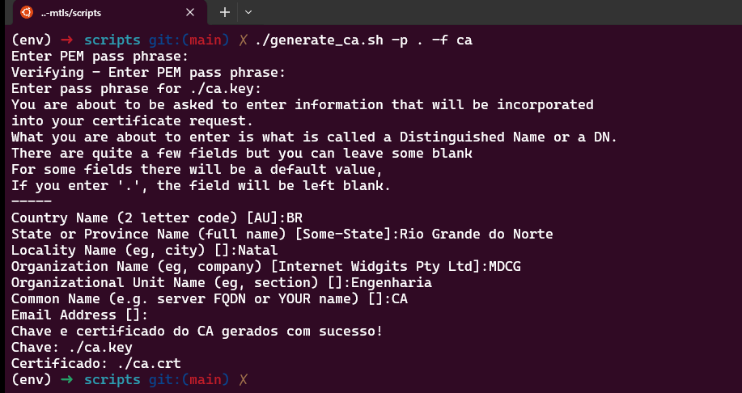
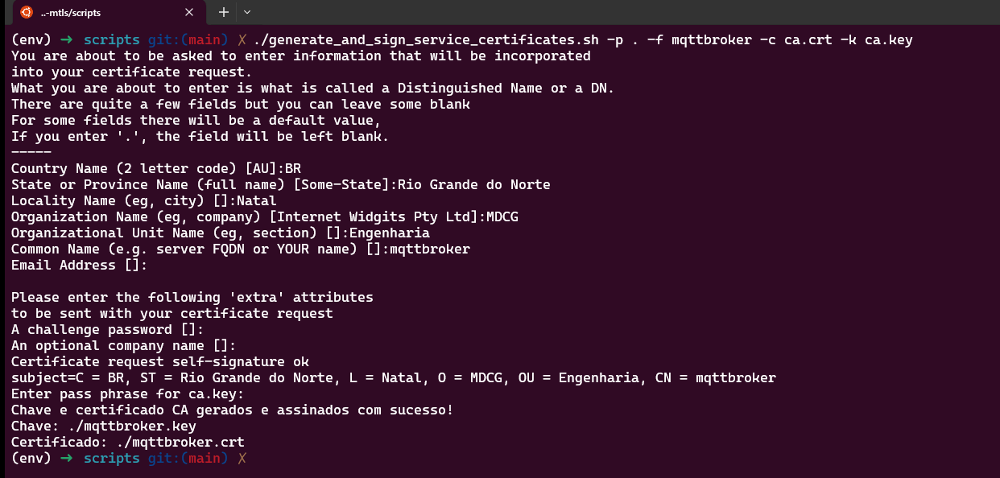
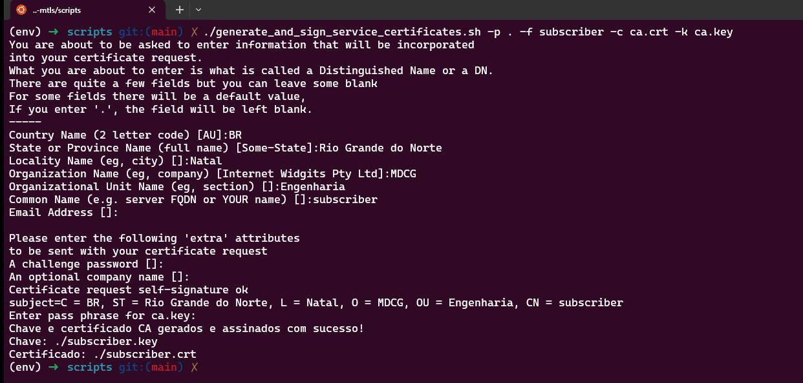
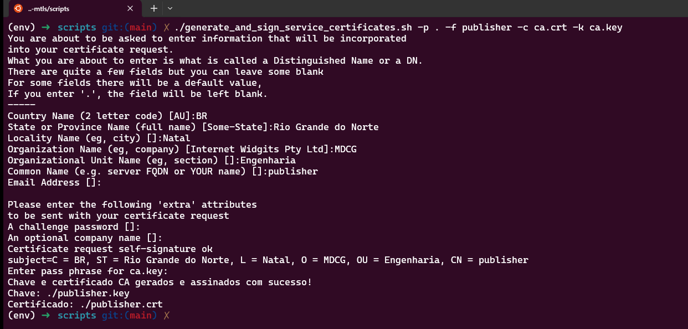

# mosquitto-mqtt-mtls

## Introdução

Este projeto tem como objetivo testar a autenticação mTLS para comunicação de sistemas MQTT. 

O mTLS, ou Transport Layer Security com mútua autenticação (mutual TLS), é uma extensão do protocolo TLS (Transport Layer Security), que é utilizado para garantir a segurança nas comunicações pela internet. O mTLS estabelece uma camada de segurança na comunicação entre dois sistemas, permitindo a autenticação mútua entre o cliente e o servidor.

Enquanto o TLS tradicional autentica apenas o servidor para o cliente, o mTLS exige que ambos, cliente e servidor, se autentiquem, fornecendo certificados digitais. Isso cria uma troca bidirecional de certificados, garantindo que ambas as partes possam validar a identidade uma da outra.

O uso do mTLS é especialmente interessante em ambientes onde a segurança é crucial, como transações financeiras, sistemas de saúde e em qualquer situação em que a autenticação recíproca seja necessária para garantir a integridade e a confidencialidade das comunicações

Para simplificar o processo de geração de chaves, certificados e assinaturas necessárias, este repositório disponibiliza uma variedade de scripts específicos para essa finalidade. As próximas seções apresentarão instruções detalhadas sobre como empregar esses scripts de maneira eficaz. Além disso, oferece-se a conveniência de "conteinerizar" as aplicações (broker, publisher e subscriber) por meio do uso do Docker e do Docker Compose.

## Gerando certificados

Para gerar uma chave privada (ca.key) e um certificado autoassinado (ca.crt) para uma autoridade certificadora (CA). Ao executá-lo, você precisará preencher algumas informações para que o certificado seja gerado com sucesso. O `PEM pass phrase` (senha) e o `Common Name` são as informações mais importantes, logo, certifique-se de tomar cuidado quando for preenchê-las. Abaixo segue o comando que utilizaremos para fins de teste e uma imagem ilustrando um possível preenchimento:

Utilização: `./generate_ca.sh -p <caminho> -f <nome do arquivo>`

```bash
chmod +x generate_ca.sh
./generate_ca.sh -p . -f ca
```



Após gerar os certificados do CA, vamos criar certificados assinados para o broker, subscriver e publisher usando a CSR, a chave privada da autoridade certificadora (ca.key) e o certificado da autoridade certificadora (ca.crt). É válido ressaltar que os certificados são válidos por 1 ano. Abaixo segue os comandos que utilizaremos para fins de teste e algumas imagens ilustrando um possível preenchimento:

Utilização: `./generate_and_sign_service_certificates.sh -p <caminho> -f <nome do arquivo> -c <localização do certificado CA> -k <localização da chave CA>`

**IMPORTANTE!:** Para criar o certificado para o broker, é necessário que o "Common Name" seja o host do mesmo. Por exemplo, se você estiver rodando essa aplicação localmente, o Common Name deve ser "localhost". Como estamos utilizando o Docker para os nossos testes, o mesmo deverá ser atribuído com o nome "mqttbroker" (que é o nome do serviço que está atrelado ao `docker-compose.yml`)

```bash
chmod +x generate_and_sign_service_certificates.sh 
./generate_and_sign_service_certificates.sh -p . -f mqttbroker -c ca.crt -k ca.key
./generate_and_sign_service_certificates.sh -p . -f subscriber -c ca.crt -k ca.key
./generate_and_sign_service_certificates.sh -p . -f publisher -c ca.crt -k ca.key
```





Uma vez que todos os certificados e chaves tenham sido preenchidos, para fins de testes, vamos mover estes arquivos para a pasta `config`, que será utilizada para buildar as imagens e criar os containers Docker:

```bash
mv *.crt ../config/
mv *.csr ../config/
mv *.key ../config/
```

## Executando os testes utilizando o Docker

Após ter gerado todos os certificados e movido os mesmos para a pasta `config`, nós podemos utilizar o Docker e Docker Compose para fazermos os testes. A execução é bastante simples, basta executar:

```
docker-compose up
```

## Considerações finais

Qualquer dúvida ou sugestão sinta-se a vontade para abrir uma issue. Além disso, sinta-se livre para fazer o que quiser com esse repositório! ;-)

## Referências

- [MQTT Mutual Certificate Authentication - Kaj Suaning - Medium](https://medium.com/@kajsuaning/mqtt-mutual-certificate-authentication-f51bc6e1a457)
- [mqtt_cert_auth - Repositório - GitHub](https://github.com/ksuaning-au/mqtt_cert_auth)
